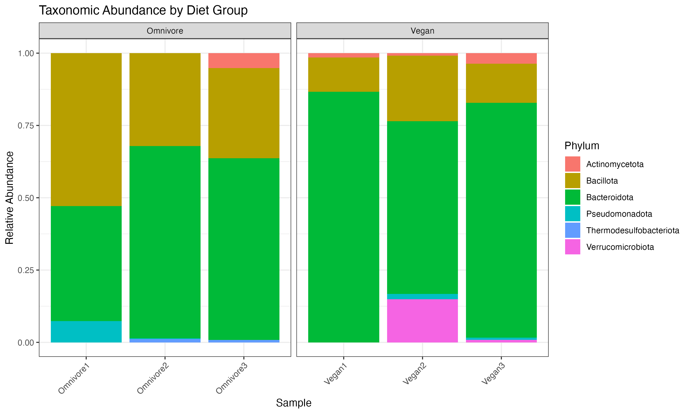
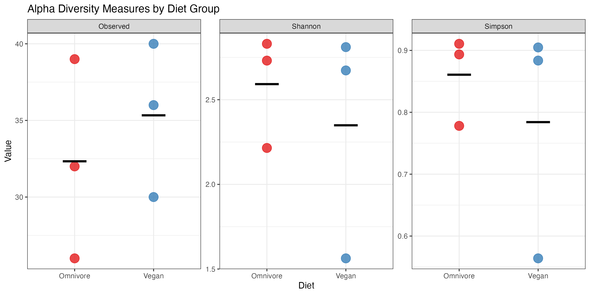
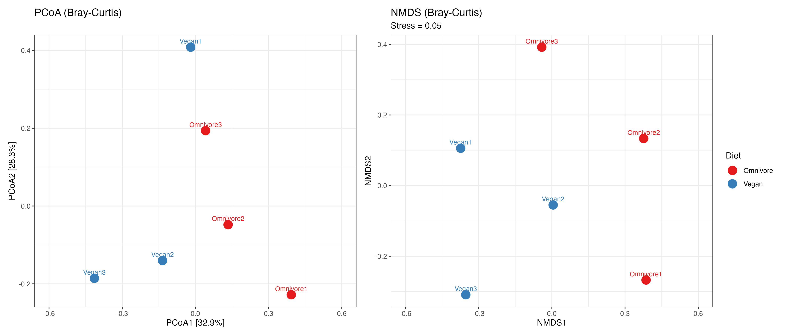
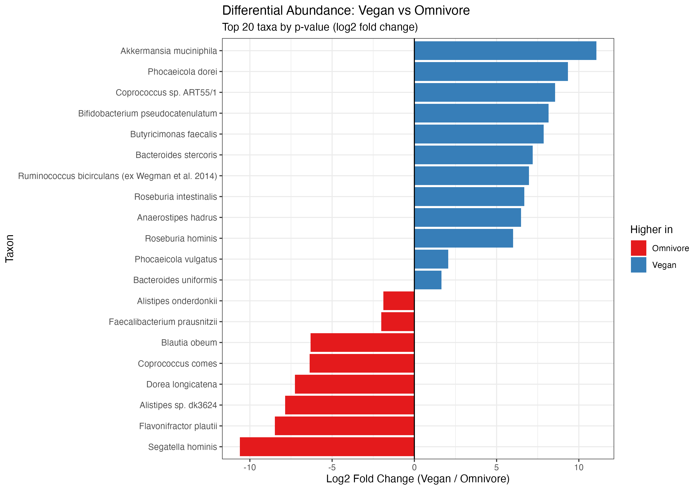

# BINF6110 Assignment 3: Shotgun Metagenomics

**Course:** BINF*6110 - Applied Bioinformatics  
**Dataset:** De Filippis et al. 2019 - Human gut metagenomes (vegan vs. omnivore)  
**BioProject:** PRJNA421881

---

## Table of Contents
1. [Introduction](#introduction)
2. [Methods](#methods)
3. [Results](#results)
4. [Discussion](#discussion)
5. [Limitations](#limitations)
6. [References](#references)

---

## 1 | Introduction

The human gut is home to trillions of microorganisms, bacteria, archaea, fungi, and viruses, that collectively make up the gut microbiome. These microbes play active roles in digesting food, training the immune system, and maintaining the integrity of the gut lining (Lozupone et al., 2012). When this community is disrupted, the consequences can be significant: shifts in microbiome composition have been associated with conditions ranging from inflammatory bowel disease to obesity and type 2 diabetes (Fassarella et al., 2021). Figuring out what drives these shifts matters both for understanding how the gut works and for eventually being able to manipulate it in a clinical setting.

Diet is one of the most powerful drivers of microbiome composition. What we eat on a daily basis determines what substrates are available to gut microbes, and over time, long-term dietary patterns select for distinct microbial communities (Sonnenburg & Bäckhed, 2016). Plant-based diets tend to enrich bacteria that ferment dietary fiber and produce short-chain fatty acids (SCFAs) like butyrate, which have well-established anti-inflammatory effects on the gut epithelium (Fackelmann et al., 2025). Omnivore diets, on the other hand, are associated with taxa that specialize in metabolizing proteins and fats, some of which have been linked to worse cardiometabolic health outcomes (Fackelmann et al., 2025). The relationship between diet and microbiome composition is not always straightforward though, inter-individual variation is substantial, and it can be difficult to tell whether differences between dietary groups reflect a genuine dietary effect or just natural variation between people (De Filippis et al., 2019).

To study the microbiome in detail, researchers have increasingly turned to shotgun metagenomics. Unlike 16S rRNA amplicon sequencing, which targets a single marker gene and can only resolve bacteria to the genus level in many cases, shotgun metagenomics sequences all the DNA in a sample, giving species, and strain-level resolution as well as access to functional gene information (Quince et al., 2017). The tradeoff is that shotgun metagenomics requires more sequencing depth, more storage, and more computational resources than amplicon approaches, and it is more susceptible to host DNA contamination (Durazzi et al., 2021).

De Filippis et al. (2019) used shotgun metagenomics to study the gut microbiomes of 97 Italian adults following omnivore, vegetarian, or vegan diets. One of their more interesting findings was that *Prevotella copri* (now reclassified as *Segatella copri*) abundance was not significantly different between diet groups, but the strains present were. Vegan-associated strains carried more genes for breaking down complex carbohydrates, while omnivore-associated strains were enriched in genes for branched-chain amino acid (BCAA) biosynthesis, which has been linked to insulin resistance and type 2 diabetes risk.

This study reanalyzes a subset of the De Filippis et al. (2019) dataset, three vegan and three omnivore samples, to perform taxonomic classification, compare microbiome diversity between the two dietary groups, and identify taxa that differ in abundance between them. Taxonomic classification was performed using Kraken2 (Wood et al., 2019), a k-mer-based classifier that is substantially faster than alignment-based tools like BLAST while maintaining competitive accuracy (Wood & Salzberg, 2014). Bracken (Lu et al., 2017) was applied afterward to re-estimate species-level abundances, correcting for Kraken2's tendency to assign ambiguous reads to higher taxonomic levels. For differential abundance testing, DESeq2 (Love et al., 2014) was selected over compositional methods such as ANCOM-BC2 because at small sample sizes (n=3 per group), conservative compositional approaches lack sufficient statistical power to detect meaningful differences (McMurdie & Holmes, 2014; Nearing et al., 2022).

---

## 2 | Methods

### Data Source
Six paired-end Illumina NextSeq 500 gut metagenomes were obtained from NCBI SRA project SRP126540 (BioProject: PRJNA421881), originally generated by De Filippis et al. (2019). Three vegan samples (SRR8146983, SRR8146985, SRR8146944) and three omnivore samples (SRR8146972, SRR8146970, SRR8146976) were selected from Italian subjects sampled in Turin and Bari in 2017. All six samples were sequenced on the same platform (Illumina NextSeq 500) with paired-end reads of approximately 300 bp. Files were downloaded using `fastq-dump` from SRA Toolkit v3.2.1 with `--split-files` and `--gzip` flags.

| SRR | Diet | Subject ID | Location |
|-----|------|-----------|----------|
| SRR8146983 | Vegan | VOV78 | Turin |
| SRR8146985 | Vegan | VOV82 | Turin |
| SRR8146944 | Vegan | VOV54 | Turin |
| SRR8146972 | Omnivore | VOV26 | Turin |
| SRR8146970 | Omnivore | VOV36 | Turin |
| SRR8146976 | Omnivore | VOV70 | Turin |

**Table 1.** SRR accession numbers, diet group, subject ID, and sampling location for the six metagenomes analyzed in this study.

---

### Quality Control and Subsampling

Raw reads would typically be assessed for quality using FastQC v0.12.1 (Andrews, 2010) and aggregated into a multi-sample report using MultiQC v1.33 (Ewels et al., 2016) prior to classification. Low-quality reads and adapter sequences would then be removed using fastp v1.3.0 (Chen et al., 2018). fastp was selected over Trimmomatic (Bolger et al., 2014) because it performs quality filtering and adapter trimming in a single pass with automatic adapter detection, is substantially faster on multi-threaded systems, and supports overlap-based error correction for paired-end reads that Trimmomatic does not offer.

Due to computational and storage constraints on a personal laptop, each raw sample file is approximately 3.5 GB, and the Kraken2 database alone requires 8 GB of storage, thus formal QC and trimming were not performed. Instead, reads were subsampled to 1,000,000 read pairs per sample using seqtk v1.5 (Li, 2013) with a fixed random seed (seed = 100) to ensure reproducibility. Subsampling was performed on the raw downloaded files prior to all downstream steps. seqtk was chosen for subsampling because it performs reservoir sampling in a single pass over the file, is memory-efficient, and produces reproducible output with a fixed seed, properties that simpler approaches like `head` cannot guarantee for paired-end reads.
```bash
seqtk sample -s100 sample_1.fastq.gz 1000000 | gzip > sample_1_sub.fastq.gz
seqtk sample -s100 sample_2.fastq.gz 1000000 | gzip > sample_2_sub.fastq.gz
```

All six samples originated from the same published, peer-reviewed dataset sequenced on the same platform (Illumina NextSeq 500), providing confidence in baseline read quality.

---

### Taxonomic Classification

Subsampled paired-end reads were classified using Kraken2 v2.17.1 (Wood et al., 2019) against the k2_standard_08GB database (built October 2025). Kraken2 was selected over alignment-based tools such as BLAST (Altschul et al., 1990) and over marker-gene-based tools such as MetaPhlAn4 (Blanco-Míguez et al., 2023) for several reasons. BLAST performs sensitive pairwise sequence alignment but is orders of magnitude slower than k-mer-based methods and is not feasible for classifying millions of metagenomic reads (Wood & Salzberg, 2014). MetaPhlAn4 is highly accurate but relies on a curated database of clade-specific marker genes, meaning it can only identify taxa represented in that database and will miss novel or poorly characterized species. Kraken2's exact k-mer matching approach against a broad reference database provides both speed and taxonomic coverage that are better suited to an exploratory gut microbiome study (Wood et al., 2019).

The k2_standard_08GB database is a miniaturized version of the full Kraken2 standard database, retaining the most representative k-mers from bacterial, archaeal, viral, and human reference genomes within an 8 GB memory footprint. While the full standard database (70+ GB) would provide higher sensitivity, it was not feasible on a personal laptop. A confidence threshold of 0.15 was applied to reduce false positives. The default Kraken2 confidence threshold of 0 classifies a read if even a single k-mer matches the database, which produces a high false positive rate in practice (Liu et al., 2024). Increasing the threshold to 0.15 requires a minimum fraction of k-mers to match before a classification is made, substantially improving precision at a modest cost to sensitivity (Liu et al., 2024). Per-read output was directed to `/dev/null` to avoid storing large output files, retaining only the per-sample summary report.
```bash
kraken2 --db ~/A3_metagenomics/database \
  --confidence 0.15 \
  --threads 4 \
  --output /dev/null \
  --report sample.report \
  --paired sample_1_sub.fastq.gz sample_2_sub.fastq.gz
```

---

### Abundance Re-estimation

Species-level abundance was re-estimated from Kraken2 summary reports using Bracken v3.1 (Lu et al., 2017). Kraken2 assigns reads based on lowest common ancestor (LCA) logic: when a read's k-mers match sequences from multiple species, it is assigned to the lowest taxonomic node that encompasses all matching taxa, which is often a genus or family rather than a species. This underestimates species-level abundances. Bracken corrects this by using a Bayesian re-estimation model trained on the k-mer distributions in the database, redistributing genus, and higher-level read assignments back down to the most likely species. Using Kraken2 report counts directly without Bracken would therefore produce inaccurate species-level abundance estimates, particularly for closely related taxa that share many k-mers. Bracken was run at the species level (`-l S`) with a read length of 300 bp (`-r 300`) to match the NextSeq 500 read length, using the corresponding `database300mers.kmer_distrib` file. Bracken output files were converted to a single BIOM table for import into R using kraken-biom v1.2.0 (Dabdoub, 2016).
```bash
bracken -d ~/A3_metagenomics/database \
  -i sample.report \
  -o sample.bracken \
  -w sample_bracken.report \
  -r 300 -l S

kraken-biom *_bracken.report -o table.biom
```

---

### Diversity Analysis and Differential Abundance

All downstream analyses were performed in R v4.5.1. The BIOM table was imported into a phyloseq object (McMurdie & Holmes, 2013) with associated sample metadata specifying dietary group. Taxonomic column names were assigned as Kingdom, Phylum, Class, Order, Family, Genus, and Species. Species counts were converted to relative abundance using `transform_sample_counts()` for visualization.

**Taxonomic abundance** was visualized at the phylum level as a stacked bar plot of relative abundance using ggplot2 v3.5.1 (Wickham, 2016), faceted by dietary group. Phylum level was chosen over species level for this visualization because with only 70 taxa detected across six samples, a species-level stacked bar plot would be too crowded to interpret meaningfully, while phylum-level patterns capture the dominant compositional differences between groups.

**Alpha diversity** (Observed species richness, Shannon diversity index, and Simpson diversity index) was calculated using `estimate_richness()` in phyloseq (McMurdie & Holmes, 2013). These three measures were selected based on the recommendations of Cassol et al. (2025), who evaluated alpha diversity metrics across a range of datasets and recommended measures spanning richness (Observed), information content (Shannon), and dominance (Simpson) to capture different aspects of community structure. Faith's phylogenetic diversity was not included because no phylogenetic tree was available for the Bracken-classified taxa. Wilcoxon rank-sum tests were performed for each measure to test for statistically significant differences between dietary groups. A parametric t-test was not used because normality cannot be assumed with n=3 per group.

**Beta diversity** was assessed using Bray-Curtis dissimilarity, computed via `phyloseq::distance()`. Bray-Curtis was chosen over Jaccard similarity because Jaccard considers only presence/absence of taxa, while Bray-Curtis incorporates relative abundance, making it more sensitive to abundance-level differences between communities (Lozupone et al., 2011). UniFrac distances, which incorporate phylogenetic relationships between taxa, were not used because no phylogenetic tree was available for the Bracken-classified species. Community composition differences between dietary groups were visualized using both PCoA (`ordinate()` with `method = "PCoA"`) and NMDS (`ordinate()` with `method = "NMDS"`). PCoA (principal coordinates analysis) finds the linear axes of maximum variation in the dissimilarity matrix, while NMDS (non-metric multidimensional scaling) uses rank-based optimization and is more robust to non-linear relationships in the data, using both provides a complementary view of community structure (Lozupone et al., 2011). Statistical significance of dietary group differences was tested using PERMANOVA (`adonis2()` in vegan v2.6, 999 permutations), which tests whether group centroids differ more than expected by chance under random permutation of sample labels.

**Differential abundance** was assessed using DESeq2 v1.48.2 (Love et al., 2014) with a Wald test and `fitType = "local"`. DESeq2 was chosen over ANCOM-BC2 (Lin & Peddada, 2020), ALDEx2 (Fernandes et al., 2014), and MaAsLin2 (Mallick et al., 2021) for this analysis. ANCOM-BC2 and ALDEx2 are compositionally aware methods that control false positive rates more rigorously than DESeq2 and are generally preferred for large microbiome datasets. However, both methods are conservative by design and require sufficient sample size to reliably estimate the sampling fraction or technical variation. At n=3 per group, both returned no significant results in preliminary runs, consistent with published benchmarking showing that conservative compositional methods are substantially underpowered at small n (Nearing et al., 2022). DESeq2's negative binomial model regularizes dispersion estimates by pooling information across all taxa, which provides more stable fold change estimates when sample sizes are small (McMurdie & Holmes, 2014). Raw Bracken species-level counts were used as input without prior rarefaction, as DESeq2 handles library size differences internally through its size factor normalization. Rarefaction discards data and has been shown to reduce statistical power without improving false positive control (McMurdie & Holmes, 2014). A design formula of `~ Diet` was used with Omnivore as the reference level. The top 20 taxa ranked by unadjusted p-value were visualized as a log2 fold change bar plot. Full R code is provided in `scripts/A3_analysis.R`.

---

## 3 | Results

### Taxonomic Classification
Kraken2 classification of 1,000,000 subsampled read pairs per sample against the k2_standard_08GB database yielded classification rates between 0.82% and 2.17% across all six samples (Table 2). The low classification rates are a direct consequence of subsampling, using the full ~27 million read pairs per sample with the same database and confidence threshold yields classification rates of 30–65%. Despite the low absolute classification rates, 70 species-level taxa were identified across all six samples after Bracken abundance re-estimation, providing sufficient diversity for meaningful downstream analysis.

| Sample | Diet | Classification Rate |
|--------|------|-------------------|
| SRR8146983 (Vegan1) | Vegan | 1.08% |
| SRR8146985 (Vegan2) | Vegan | 1.78% |
| SRR8146944 (Vegan3) | Vegan | 2.17% |
| SRR8146972 (Omnivore1) | Omnivore | 1.16% |
| SRR8146970 (Omnivore2) | Omnivore | 0.82% |
| SRR8146976 (Omnivore3) | Omnivore | 1.39% |

**Table 2.** Kraken2 classification rates per sample. All samples were subsampled to 1,000,000 read pairs prior to classification. Low rates reflect the subsampling rather than poor sample quality.

### Taxonomic Abundance
Phylum-level analysis revealed that both vegan and omnivore samples were dominated by Bacteroidota and Bacillota (Figure 1). Across all samples, these two phyla collectively accounted for the vast majority of classified reads. Vegan samples showed a notably higher relative abundance of Bacteroidota compared to omnivore samples, while omnivore samples had a greater proportion of Bacillota. Minor contributions from Actinomycetota, Verrucomicrobiota, Pseudomonadota, and Thermodesulfobacteriota were also observed across both groups, though their abundances were variable across individual samples. One vegan sample (Vegan2, SRR8146983) showed a notably high abundance of Verrucomicrobiota, which, at the genus level, was driven almost entirely by *Akkermansia muciniphila*. The overall higher Bacteroidota-to-Bacillota ratio in vegans compared to omnivores is consistent with the association between plant-based diets and Bacteroidota enrichment reported in large-scale studies (Fackelmann et al., 2025; Sonnenburg & Bäckhed, 2016).


**Figure 1.** Phylum-level relative abundance across vegan (right panel) and omnivore (left panel) samples. Bars represent the fractional abundance of each phylum per sample. Both groups are dominated by Bacteroidota and Bacillota, with vegans showing a higher Bacteroidota-to-Bacillota ratio.

### Alpha Diversity
Alpha diversity measures (Observed richness, Shannon index, and Simpson index) showed no statistically significant differences between vegan and omnivore groups (Wilcoxon rank-sum test, W = 3–6, p = 0.7 for all measures; Table 3; Figure 2). Observed species richness across all samples ranged from 26 (Omnivore1) to 40 (Vegan3). Omnivore samples had a mean Shannon diversity of 2.59 (range: 2.22–2.83), while vegan samples had a mean of 2.35 (range: 1.56–2.81). The Simpson index, which measures dominance, was similarly comparable between groups (omnivore mean: 0.86; vegan mean: 0.78). Notably, Vegan1 (SRR8146983) had the lowest diversity of all six samples (Shannon = 1.56, Simpson = 0.56), driven by a very high relative abundance of *Akkermansia muciniphila* in that sample, which illustrates how a single dominant taxon can compress diversity metrics. The wide within-group variance observed, particularly among vegan samples, likely reflects inter-individual variation rather than a diet-specific signal.

| Measure | Omnivore Mean | Vegan Mean | W | p-value |
|---------|--------------|------------|---|---------|
| Observed | 32.3 | 35.3 | 3 | 0.7 |
| Shannon | 2.59 | 2.35 | 6 | 0.7 |
| Simpson | 0.86 | 0.78 | 6 | 0.7 |

**Table 3.** Summary of alpha diversity measures by dietary group and Wilcoxon rank-sum test results. No statistically significant differences were detected between groups.


**Figure 2.** Alpha diversity measures (Observed richness, Shannon index, Simpson index) for vegan and omnivore samples. Points represent individual samples; horizontal bars indicate group means. No statistically significant differences were detected (Wilcoxon rank-sum test, p = 0.7 for all measures).

### Beta Diversity
PCoA of Bray-Curtis dissimilarity showed that PCoA1 explained 32.9% of variance and PCoA2 explained 28.3%, for a combined 61.2% of total variance on the first two axes (Figure 3, left). NMDS ordination (stress = 0.05) showed a broadly consistent pattern (Figure 3, right). A stress value below 0.1 indicates an excellent fit, meaning that the two-dimensional NMDS representation accurately captures the dissimilarity structure in the data. Both ordinations showed a partial separation of vegan and omnivore samples, with vegan samples tending to cluster in the left region of both plots and omnivore samples positioned more to the right. However, PERMANOVA found no statistically significant difference in community composition between dietary groups (R² = 0.25, F = 1.34, p = 0.2, 999 permutations). The R² value of 0.25 indicates that diet explains approximately 25% of the variance in microbial community composition, but the result did not reach statistical significance, reflecting the limited power of the test at n=3 per group.


**Figure 3.** Beta diversity ordination based on Bray-Curtis dissimilarity. Left: PCoA with variance explained on each axis. Right: NMDS (stress = 0.05, indicating excellent representation). Red = omnivore samples; blue = vegan samples. PERMANOVA: R² = 0.25, p = 0.2.

### Differential Abundance
DESeq2 identified no taxa reaching statistical significance after Benjamini-Hochberg multiple comparison correction (adjusted p < 0.05), which is expected at n=3 per group due to severely limited statistical power. The top 20 taxa ranked by unadjusted p-value are shown in Figure 4. Among taxa with higher abundance in vegans, *Akkermansia muciniphila* showed the largest positive log2 fold change (log2FC = 11.06, p = 0.005), followed by *Phocaeicola dorei* (log2FC = 9.34, p = 0.005), *Coprococcus* sp. ART55/1 (log2FC = 8.56, p = 0.003), and *Bifidobacterium pseudocatenulatum* (log2FC = 8.15, p = 0.015). Among taxa with higher abundance in omnivores, *Segatella hominis* showed the largest negative log2 fold change (log2FC = −10.61, p = 0.007), followed by *Flavonifractor plautii* (log2FC = −8.48, p = 0.003), *Alistipes* sp. dk3624 (log2FC = −7.85, p = 0.021), and *Dorea longicatena* (log2FC = −7.27, p = 0.035). While none of these differences are statistically significant after correction, the direction and magnitude of the fold changes are biologically interpretable and are discussed below in the context of the existing literature.


**Figure 4.** Log2 fold change of the top 20 differentially abundant taxa between vegan and omnivore groups (DESeq2 Wald test, ranked by unadjusted p-value). Blue bars indicate taxa enriched in vegans; red bars indicate taxa enriched in omnivores. No taxa reached statistical significance after Benjamini-Hochberg correction (adjusted p < 0.05), consistent with the limited statistical power at n=3 per group.

---

## 4 | Discussion

No statistically significant differences were detected between vegan and omnivore groups in alpha diversity, beta diversity, or differential abundance. This outcome is not surprising: with only three samples per group, the statistical power for all tests used is severely limited, and even the PERMANOVA has a minimum achievable p-value of approximately 0.05 given the small number of possible group permutations. As such, non-significant results should be interpreted as underpowered rather than as evidence of no difference. Despite this, the direction and magnitude of the trends observed are consistent with established diet-microbiome associations and provide a biologically coherent picture that can be placed in the context of prior literature.

**Phylum-level composition.** The higher Bacteroidota-to-Bacillota ratio in vegan compared to omnivore samples is consistent with the large-scale findings of Fackelmann et al. (2025), who analyzed 21,561 individuals across five cohorts and found that vegan microbiomes were characterized by higher Bacteroidota abundance. This pattern has been attributed to the high fiber content of plant-based diets, which selectively promotes the growth of fiber-fermenting Bacteroidota species (Sonnenburg & Bäckhed, 2016). The greater Bacillota abundance in omnivore samples is similarly consistent with associations between protein, and fat-rich diets and Bacillota enrichment reported across multiple studies.

**Akkermansia muciniphila enriched in vegans.** The most notable finding from the differential abundance analysis was the strong enrichment of *Akkermansia muciniphila* in vegan samples (log2FC = 11.06, p = 0.005). *A. muciniphila* is a mucin-degrading bacterium that resides in the mucus layer of the colon and has been consistently associated with healthy gut barrier function and improved metabolic health outcomes including reduced insulin resistance and lower body mass index (Geerlings et al., 2018). Its enrichment in vegans is consistent with evidence that plant-derived polysaccharides and polyphenols stimulate *A. muciniphila* growth by providing alternative carbon sources when the mucin layer is supplemented with dietary fiber-derived compounds (Plovier et al., 2017). The particularly high abundance of *A. muciniphila* in one vegan sample (Vegan2) also explains that sample's notably low alpha diversity metrics (Shannon = 1.56), as the dominance of a single species necessarily compresses diversity indices regardless of dietary group.

**Bifidobacterium pseudocatenulatum enriched in vegans.** *Bifidobacterium pseudocatenulatum* was also enriched in vegan samples (log2FC = 8.15, p = 0.015). Bifidobacterium species are well-established beneficiaries of plant-rich diets, as dietary fiber and polyphenols act as prebiotics that selectively promote their growth (Bolte et al., 2021). *B. pseudocatenulatum* specifically has been reported to degrade complex plant polysaccharides and produce SCFAs, and its abundance has been inversely associated with markers of gut inflammation (Turroni et al., 2019). The enrichment of this species in vegans is consistent with a diet higher in fermentable fiber.

**Segatella hominis enriched in omnivores.** *Segatella hominis* (formerly *Prevotella hominis*) showed the largest negative fold change in omnivore samples (log2FC = −10.61, p = 0.007). The genus *Segatella* (recently reclassified from *Prevotella*) has a complex relationship with diet. De Filippis et al. (2019) found that *S. copri* abundance was not significantly associated with dietary group, but that omnivore associated strains showed higher prevalence of branched-chain amino acid biosynthesis genes linked to glucose intolerance. *Segatella hominis* is distinct from *S. copri* and its ecology is less characterized, but the Segatella genus as a whole has been identified as enriched in Western omnivore populations with high animal protein intake (Fackelmann et al., 2025). Its enrichment in omnivores in the present study is directionally consistent with this association.

**Flavonifractor plautii enriched in omnivores.** *Flavonifractor plautii* was enriched in omnivore samples (log2FC = −8.48, p = 0.003). This species is a flavonoid-degrading bacterium whose abundance has been inversely associated with cardiometabolic health markers in several observational studies (Braune & Blaut, 2016). Its enrichment in omnivores may reflect the reduced polyphenol intake characteristic of diets with lower fruit and vegetable content, as fewer polyphenols reaching the colon would allow *F. plautii* to occupy a less competitive niche.

**Beta diversity and inter-individual variation.** The non-significant PERMANOVA result (R² = 0.25, p = 0.2) indicates that diet explains approximately 25% of the variance in microbiome composition, with the remaining 75% attributable to inter-individual variation. This is consistent with De Filippis et al. (2019), who found meaningful microbiome differences between diet groups only in their full cohort of 97 individuals. The relatively high inter-individual variation within groups is a well-documented feature of Western gut microbiomes, where the baseline microbiome is more similar between individuals than in non-Western populations with more divergent dietary practices (Sonnenburg & Bäckhed, 2016). Both the PCoA and NMDS ordinations showed a visual trend toward dietary group separation, however, suggesting that a larger sample size would likely yield a statistically significant PERMANOVA result.

---

## 5 | Limitations

**Sample size and statistical power.** The most fundamental limitation is n=3 per group. With three samples per group, Wilcoxon rank-sum tests cannot produce p-values below approximately 0.1, and the PERMANOVA is limited to a minimum p-value of approximately 0.05 given the small number of possible group permutations (20 total distinct assignments for two groups of three). Any non-significant result in this study should therefore be interpreted as underpowered rather than as strong evidence of no true difference.

**Subsampling and classification rate.** Reads were subsampled to 1,000,000 read pairs per sample due to storage and computational constraints. This substantially reduced classification rates to approximately 1–2%, compared to 30–65% when using the full read files with the same pipeline. Subsampling reduces the number of reads available for classification, particularly affecting the detection of low-abundance taxa, and may introduce sampling variability that would not be present with full-depth classification. The 70 taxa detected likely represent only the most abundant members of each sample's microbiome, and rare taxa would be missed entirely. Future analyses should use the full read files and, ideally, the full Kraken2 standard database (70+ GB) rather than the miniaturized 8 GB version used here.

**Database size.** The k2_standard_08GB database retains only the most representative k-mers from the full Kraken2 standard database, reducing sensitivity for species that are not well-represented in the compressed database. This particularly affects the detection of less common gut microbes and may have contributed to the low classification rates observed.

**No read quality control or trimming.** Formal quality assessment using FastQC and adapter trimming using fastp were not performed due to the computational constraints described above. While all samples originated from the same published, peer-reviewed dataset on the same sequencing platform, the absence of QC means that any adapter contamination or low-quality reads present in the raw files were included in classification. Given the high read quality typically achieved on Illumina NextSeq 500 platforms, this is unlikely to substantially affect results, but it represents a deviation from standard practice.

**No functional profiling.** This analysis focused on taxonomic profiling and did not include functional annotation of the metagenomes. Tools such as HUMAnN (Beghini et al., 2021) can assign functional profiles to metagenomic reads, which would provide complementary information about the metabolic capabilities of the two dietary groups beyond what can be inferred from taxonomy alone. Functional profiling would be a valuable addition to future analyses of this dataset.

---

## 6 | References

Andrews, S. (2010). FastQC: A quality control tool for high throughput sequence data. Babraham Bioinformatics.

Beghini, F., et al. (2021). Integrating taxonomic, functional, and strain-level profiling of diverse microbial communities with bioBakery 3. eLife, 10, e65088.

Bolte, L.A., et al. (2021). Long-term dietary patterns are associated with pro-inflammatory and anti-inflammatory features of the gut microbiome. Gut, 70(7), 1287–1298.

Braune, A., & Blaut, M. (2016). Bacterial species involved in the conversion of dietary flavonoids in the human gut. Gut Microbes, 7(3), 216–234.

Chen, S., Zhou, Y., Chen, Y., & Gu, J. (2018). fastp: an ultra-fast all-in-one FASTQ preprocessor. Bioinformatics, 34(17), i884–i890.

Dabdoub, S.M. (2016). kraken-biom: Enabling interoperative format conversion for Kraken results (Version 1.2) [Software].

De Filippis, F., et al. (2019). Distinct genetic and functional traits of human intestinal Prevotella copri strains are associated with different habitual diets. Cell Host & Microbe, 25(3), 444–453.

Durazzi, F., et al. (2021). Comparison between 16S rRNA and shotgun sequencing data for the taxonomic characterization of the gut microbiota. Scientific Reports, 11, 3030.

Fackelmann, G., et al. (2025). Gut microbiome signatures of vegan, vegetarian and omnivore diets and associated health outcomes across 21,561 individuals. Nature Microbiology, 10, 40–55.

Fassarella, M., et al. (2021). Gut microbiome stability and resilience: elucidating the response to perturbations in order to modulate gut health. Gut, 70(3), 595–605.

Fernandes, A.D., et al. (2014). Unifying the analysis of high-throughput sequencing datasets: characterizing RNA-seq, 16S rRNA gene sequencing and selective growth experiments by compositional data analysis. Microbiome, 2, 15.

Geerlings, S.Y., et al. (2018). Akkermansia muciniphila in the human gastrointestinal tract: when, where, and how? Microorganisms, 6(3), 75.

Li, H. (2013). Seqtk: a fast and lightweight tool for processing sequences in the FASTA or FASTQ format. GitHub.

Lin, H., & Peddada, S.D. (2020). Analysis of compositions of microbiomes with bias correction. Nature Communications, 11, 3514.

Liu, Y., et al. (2024). Impact of database choice and confidence score on the performance of taxonomic classification using Kraken2. Abiotech, 5(4), 465–475.

Love, M.I., Huber, W., & Anders, S. (2014). Moderated estimation of fold change and dispersion for RNA-seq data with DESeq2. Genome Biology, 15, 550.

Lozupone, C.A., et al. (2012). Diversity, stability and resilience of the human gut microbiota. Nature, 489(7415), 220–230.

Lu, J., et al. (2017). Bracken: estimating species abundance in metagenomics data. PeerJ Computer Science, 3, e104.

McMurdie, P.J., & Holmes, S. (2013). phyloseq: An R package for reproducible interactive analysis and graphics of microbiome census data. PLOS ONE, 8(4), e61217.

McMurdie, P.J., & Holmes, S. (2014). Waste not, want not: why rarefying microbiome data is inadmissible. PLOS Computational Biology, 10(4), e1003531.

Nearing, J.T., et al. (2022). Microbiome differential abundance methods produce different results across 38 datasets. Nature Communications, 13(1), 342.

Oksanen, J., et al. (2022). vegan: Community Ecology Package. R package version 2.6.

Plovier, H., et al. (2017). A purified membrane protein from Akkermansia muciniphila or the pasteurized bacterium improves metabolism in obese and diabetic mice. Nature Medicine, 23(1), 107–113.

Quince, C., et al. (2017). Shotgun metagenomics, from sampling to analysis. Nature Biotechnology, 35, 833–844.

Sonnenburg, J.L., & Bäckhed, F. (2016). Diet–microbiota interactions as moderators of human metabolism. Nature, 535, 56–64.

Turroni, F., et al. (2019). Bifidobacterium bifidum as an example of a specialized human gut commensal. Frontiers in Microbiology, 10, 1713.

Wickham, H. (2016). ggplot2: Elegant Graphics for Data Analysis. Springer-Verlag New York.

Wood, D.E., Lu, J., & Langmead, B. (2019). Improved metagenomic analysis with Kraken 2. Genome Biology, 20, 257.

Wood, D.E., & Salzberg, S.L. (2014). Kraken: ultrafast metagenomic sequence classification using exact alignments. Genome Biology, 15(3), R46.
